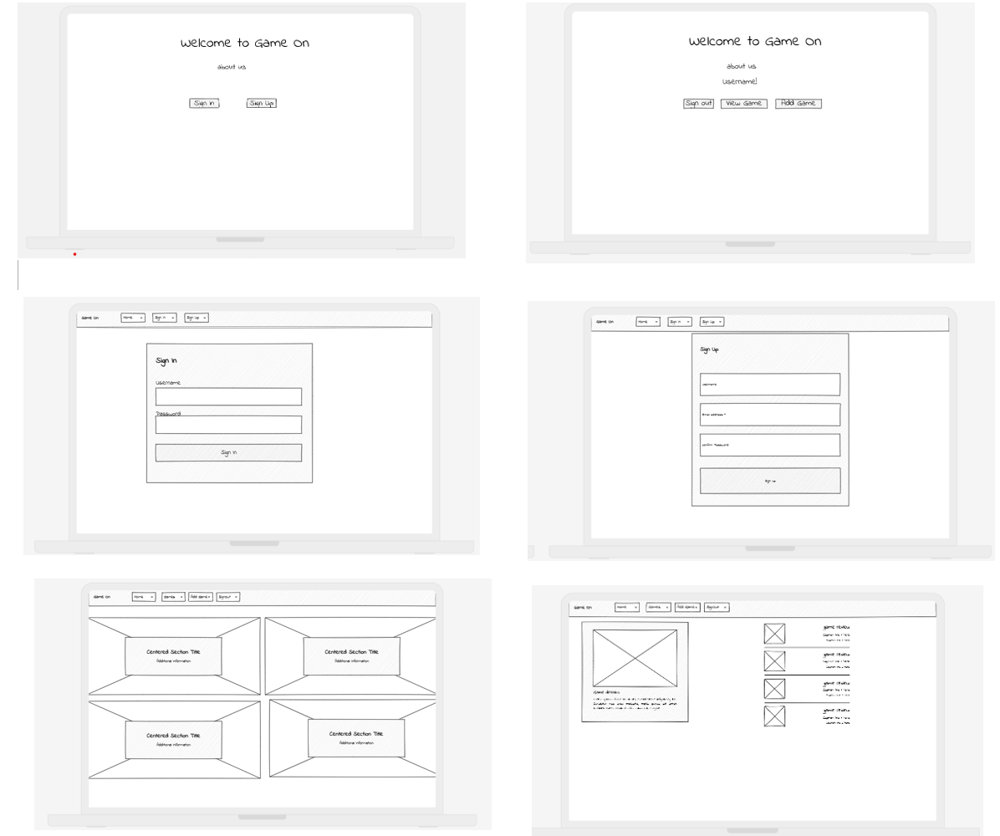

# Game On

## **Description**

The **Game Review & Management Platform** is a web application where users can:

- Browse a collection of games.
- View detailed game information, including user reviews and ratings.
- Add their own games with optional image uploads.
- Edit or delete games they’ve added.
- Write, edit, and delete reviews for any game.

This app was built to create a community-driven platform where gamers can share their favorite titles, review them, and help others discover great games.

## **Getting started:**

### **Deployed Application**

You can access the live application here: [Game Review Platform](#)

## Wire Frame:

## User Stories:

#### _For Authenticated Users:_

1. _Add a Game_

   - _As an authenticated user_, I want to upload a new game with an image so that I can share it with others.
   - _Acceptance Criteria:_
     - I can fill out a form with the name, description, type, and an optional image.
     - The game is added to the list and displayed with its details.

2. _Edit My Game_

   - \_As an authenticated user\*, I want to edit the details of a game I added so that I can fix mistakes or update the information.
   - _Acceptance Criteria:_
     - I can click an "Edit" button next to the game I added.
     - I am taken to a form pre-filled with the game's current details (e.g., name, description, type, and image).
     - I can update any field, including uploading a new image if needed.
     - After submitting, the game details are updated in the database and reflected on the website.

3. _Delete My Game_

   - _As an authenticated user_, I want to delete a game I added so that I can remove it if it’s no longer relevant.
   - _Acceptance Criteria:_
     - I can click a "Delete" button next to the game I added.
     - A confirmation prompt appears asking, "Are you sure you want to delete this game?"
     - Once confirmed, the game is removed from the database, and it no longer appears in the game list.

4. _View My Games_

   - _As an authenticated user_, I want to see a list of all games I have added so that I can manage them easily.
   - _Acceptance Criteria:_
     - I can go to a "My Games" page that shows all the games I’ve added.
     - Each game in the list has "Edit" and "Delete" options.

5. _Add a Review_

   - _As an authenticated user_, I want to leave a review for a game so that I can share my opinions with others.
   - _Acceptance Criteria:_
     - I can rate the game on a scale of 1 to 5 and leave a comment.
     - My review is displayed under the game, along with my username and the date I posted it.

6. _Edit or Delete My Review_

   - _As an authenticated user_, I want to edit or delete my own reviews so that I can update or remove my feedback.
   - _Acceptance Criteria:_
     - I can see "Edit" and "Delete" buttons next to reviews I posted.
     - Clicking "Edit" allows me to update the rating and comment.
     - Clicking "Delete" removes my review.

7. _Upload an Image for a Game_
   - _As an authenticated user_, I want to upload an image for a game I add so that the game has a visual representation.
   - _Acceptance Criteria:_ - I can upload an image when adding a game. - The image is displayed on the game’s details page.
     when someone play a game and want to share a feedback and review about it, or when a developer implement an game and want to share it to see the review the rate and the comment about it, or when someone lost and want to search about a game and see the review.

## pseudocode

Add a Game
Authenticated users can upload a game using a form that collects the game’s name, description, type, and an optional image. The form submission triggers a POST request to the server. The server validates the inputs, processes the image upload (using middleware like Multer), and stores the data in the database. Once added, the game appears dynamically on the games list, complete with its details and the uploaded image.

Edit My Game
Authenticated users can manage the games they've added. An "Edit" button next to their game triggers a GET request to fetch its current details, pre-filling a form. Users can modify any field, including uploading a new image. Upon submission, a PUT request updates the game record in the database. The website reflects these changes immediately, ensuring consistency across the platform.

Delete My Game
To remove a game, authenticated users click a "Delete" button, triggering a confirmation dialog. Once confirmed, a DELETE request is sent to the server to remove the game from the database. The game is instantly removed from the interface, ensuring the list stays up-to-date without requiring a page reload.

View My Games
Users have access to a personalized "My Games" page displaying all the games they've added. Each game includes "Edit" and "Delete" options, allowing efficient management. The server fetches only the authenticated user's game entries for this page, ensuring privacy and relevancy.

Add a Review
Users can rate and review any game, providing a rating (1 to 5) and a comment. A POST request sends the review to the server, linking it to the game and storing it in the database. The website dynamically updates to display the new review under the game, showing the username and posting date.

Edit or Delete My Review
Reviews posted by users are editable or deletable. "Edit" buttons retrieve the review's current content, enabling users to modify the rating or comment through a form. A PUT request updates the database, reflecting the changes in real-time. The "Delete" button prompts confirmation before sending a DELETE request, removing the review from the database and interface.

Upload an Image for a Game
The image upload functionality integrates with game addition and editing workflows. Uploaded images are processed on the server and stored in a designated location. Game detail pages prominently display the image, enhancing the visual appeal and context of the listing.

## ERD

## Attributes:

https://css-tricks.com/moving-backgrounds-with-mouse-position/

## **Attributions**

This project uses the following external resources and libraries:

- **[Express.js](https://expressjs.com/):** For building the backend server.
- **[Mongoose](https://mongoosejs.com/):** For MongoDB object data modeling.
- **[Multer](https://www.npmjs.com/package/multer):** For handling image uploads.
- **[mouse move](https://dev.to/clementgaudiniere/create-a-parallax-effect-when-the-mouse-moves-3km0?utm_source):** For dynamic background image
- **[mouse move](https://css-tricks.com/moving-backgrounds-with-mouse-position/):** For dynamic background image
- **[delete image](https://stackoverflow.com/questions/68936240/delete-image-with-nodejs):** For delete image from the uploads file

## **Technologies Used**

- **Frontend:**

  - HTML5, CSS, JavaScript

- **Backend:**

  - Node.js with Express.js
  - Multer for file uploads
  - MongoDB with Mongoose for database operations

- **Development Tools:**
  - Git for version control
  - Visual Studio Code as the code editor

## **Next Steps**

Planned future enhancements include:

1. **User Profiles**: Allow users to create profiles and see all the games and reviews they’ve added.
2. **Search and Filter**: Add features to search for games by name or filter by type or rating.
3. **Game Categories**: Classify games into genres/categories for easier browsing.
4. **Admin Panel**: Build an admin dashboard for moderating games and reviews.
5. **Responsive Design**: Optimize the app further for mobile devices.
6. **Social Features**: Add likes for reviews and allow users to follow each other.
