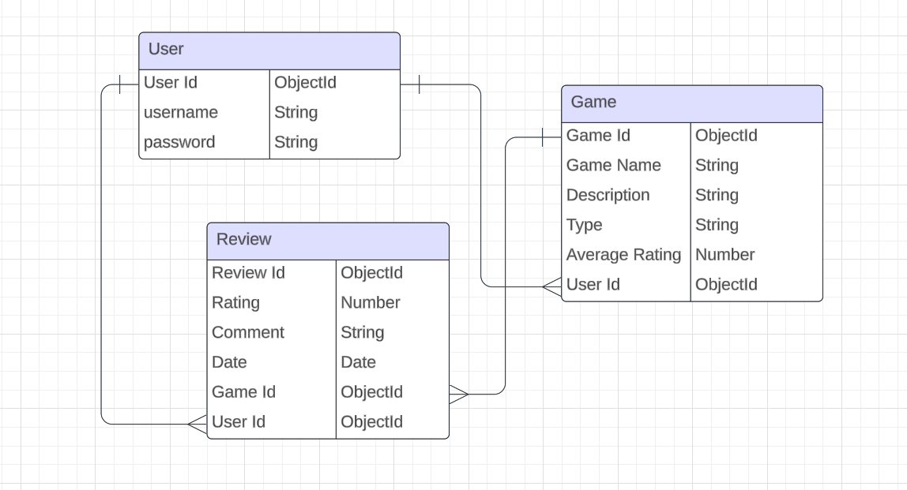

# Game-Recommendation

## User Stories

when someone play a game and want to share a feedback and review about it, or when a developer implement an game and want to share it to see the review the rate and the comment about it, or when someone lost and want to search about a game and see the review.

## pseudocode

-Inside the model folder will crete the

## ERD

## Attributes:

https://css-tricks.com/moving-backgrounds-with-mouse-position/

https://dev.to/clementgaudiniere/create-a-parallax-effect-when-the-mouse-moves-3km0?utm_source
